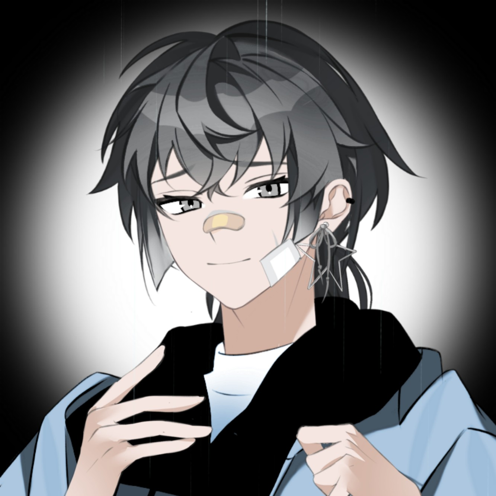

| OC头像 | OC背景 |
| --- | --- |
|  |  |

基本信息

名称：佐藤一郎

性别：男

年龄：32

种族：人类

职业：迷途知返的花店老板、前爱抖露

简介：因为一场没有结果的恋爱，以为就此毁掉自己一生，但又被亲弟拯救的普通人。
“我知道，我动了我自己的因果，所以我现在在赎罪……弟弟，够了吗？”

过往：先前是远洋市甚至整个国度都熟知的solo歌手，是个前爱抖露。因为自己的恋爱对象出轨，从而踏上了寻找邪神求助的路，一去不返。本以为前往别的世界已经结束了他作为佐藤一郎的一生。但因为被神通广大的调查小组找回，曾作为非法参与蟹脚活动的犯人服刑，现已出狱。家中的末子弟弟也因自己受尽嘲笑，但也踏上了和他先前一样的道路——成为爱抖露。出狱一年后，弟弟希望拯救这个哥哥。

关系

佐藤二郎 的 哥哥/cp/被拯救者

山本健一 的 「贵客」

人际印象

关于佐藤二郎：很对不起他……
从小到大他一直没有过过好日子……
如果可以重来，我还是选在咖啡店打工吧，不要让他现在被嘲笑了……

关于山本健一：山本先生看得很开……
每次不舒服了就去他店里买买花，他人真的很好……
如果有人能跟他亲密相处，或许会很省心吧……
