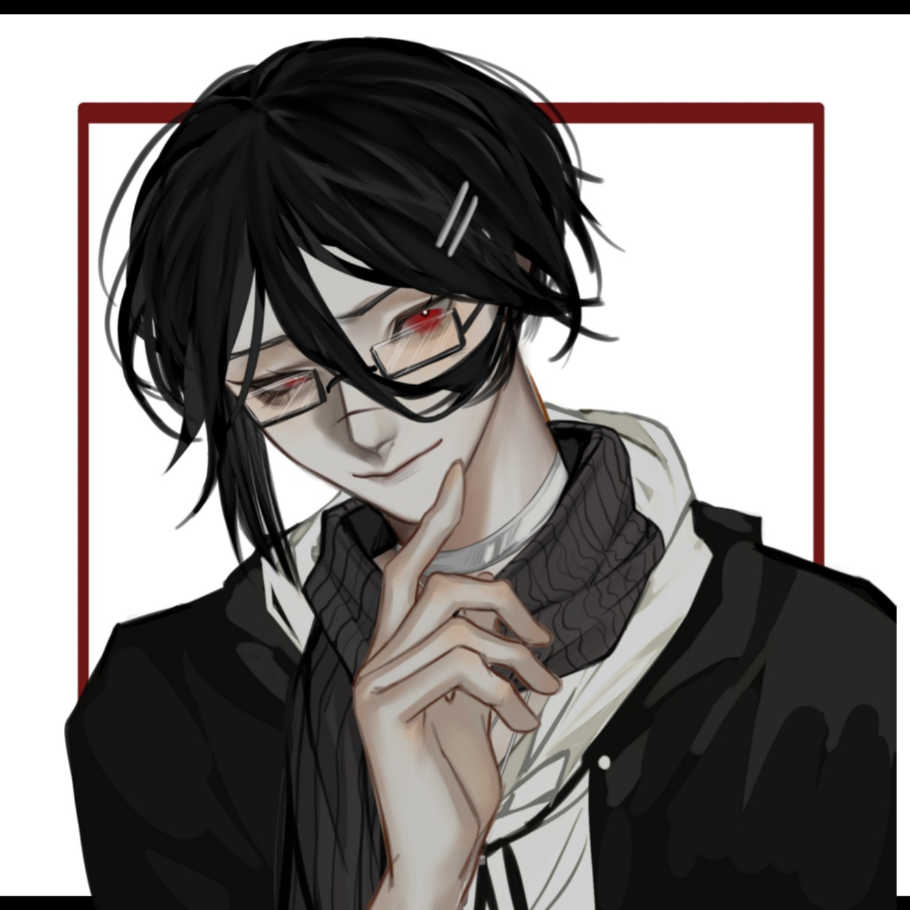

| OC头像 | OC背景 |
| --- | --- |
|  |  |

基本信息

名称：佐藤二郎

性别：男

年龄：28

种族：人类

职业：唱跳歌手

简介：希望在水泥钢筋里以自己的歌声和舞蹈，为众生开出灿烂的花的爱抖露。
“哥哥，我恨你不自爱，恨你懦弱。但是我依旧无法割舍与你的感情”

过往：从小在远洋市艺术家的家庭里长大，哥哥是以前出名的、被媒体称为“绝对闪耀的STAR”的歌手佐藤一郎，因为涉及蟹脚活动曾在监狱内服刑。自己从大哥坐牢后（大约为高中毕业的暑假）就被人看不起，发誓要出人头地。最后考入远洋大学计算机科学专业，期间开通了自己的SNS账号，在SNS平台上发布诸多翻唱视频以及翻跳视频，获得大量粉丝。之后被远洋市的ST事务所签下，以新生代solo歌手爱抖露的身份出道。佐藤一郎出狱后一年，佐藤一郎与佐藤二郎谈心，二郎决定将自己迷途知返却深入泥淖的哥哥救出，在此期间，与哥哥坠入爱河。

关系

佐藤一郎 的 弟弟/cp/拯救者

人际印象

关于哥哥：没去做「那件事」之前是懦夫。
做完了「那件事」是疯子。
现在是我爱的人。

关于山本健一和Leo：26岁的人怎么有一个16岁的小朋友当孩子，那个孩子怎么还有角？
鞭子会吓到那个小男孩？为什么？

关于本田彻：彻哥之前每天叨咕什么东西，不懂。
后面带了我哥回来，很牛。
